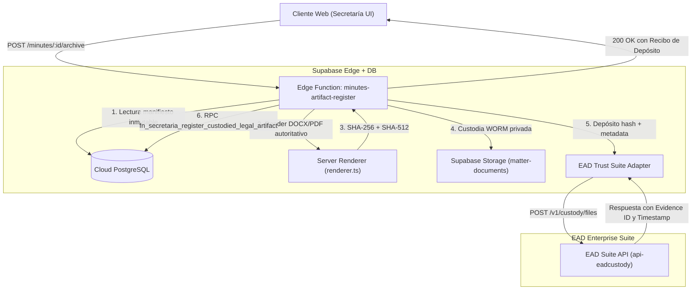

# MOI-16 · Comunicaciones y custodia EAD Trust — tabla de operaciones (2026-09-27)

**Issue:** [MOI-16](https://linear.app/moimene/issue/MOI-16/gobernanza-verificar-comunicaciones-y-custodia-en-el-alcance-del)
**Bloqueado por:** MOI-15 (Secretaría · Validar el ciclo societario y documental en un grupo nuevo)
**Base:** `main` en `751db789` (rama de trabajo `agent/moi-16-ola5`)
**Método:** lectura de código, `list_edge_functions` (metadatos, sin invocar), y `SELECT` de solo lectura vía MCP `execute_sql` contra `governance_OS` (`hzqwefkwsxopwrmtksbg`). **Cero llamadas reales a EAD Trust o Resend. Cero escrituras en Cloud.**

Este documento **repite y corrige** `docs/superpowers/specs/2026-09-25-auditoria-comunicaciones-y-custodia-ead-trust.md` (reabierto por discrepancias fácticas el 2026-09-25, rectificado el 2026-09-26). No lo sustituye como historial: lo hereda y remide contra el estado de Cloud y de `main` a día de hoy, porque en el ínterin se mergearon MOI-15 (H-32/H-33, ensayo encadenado) y MOI-142 (convocatoria de Junta), que movieron dato real del tenant Grupo Nuevo.

---

## 1. Qué cambió desde el informe del 25/26-09 (y qué no)

| Hecho | 25/26-09 | 27-09 (medido hoy) | Efecto sobre el dictamen |
|---|---|---|---|
| `convocation_manifests` en Grupo Nuevo | 2 filas | **16 filas** (`SELECT tenant_id, count(*) FROM convocation_manifests GROUP BY tenant_id`) | Crecimiento por MOI-142/H-32/H-33; todas siguen `data_class='DEMO'` (ver §2.3) |
| `meetings` en Grupo Nuevo | 1 (`ffd71122…`, `CONVOCADA`) | **7 filas**: 3 `EN_CURSO`, 4 `CONVOCADA` (`SELECT id, status, scheduled_start FROM meetings WHERE tenant_id='…0003'`) | Ninguna tiene acta (`minutes` sigue en 0 para `…0003`, ver §2.2) |
| `minutes` en Grupo Nuevo | 0 | **0** (sin cambio) | La custodia sigue sin sujeto: no hay acta que custodiar |
| `standalone_certification_kinds` en Grupo Nuevo | 38/38 activas, 0 excluidas | **38/38 activas, 0 excluidas** (sin cambio) | Confirmado con sonda de código nueva, no solo SQL puntual (§4) |
| `convocation-artifact-register` (Edge Function) | v5 (CLAUDE.md, cierre 2026-07-21) | **v7** según `list_edge_functions`, `updated_at` **2026-09-27 04:50 UTC** (commit `8cf7f650`, MOI-142) | Amplía la fuente de destinatarios aceptada (`capital_holdings` además de `condiciones_persona`) para que una Junta pueda emitirse; no toca custodia, firma ni envío |
| `convocation-supporting-artifact-register` (Edge Function) | v1 (CLAUDE.md) | **v2** según `list_edge_functions`, `updated_at` 2026-07-20 (sin cambio de código desde 2026-08-03) | Solo el número de versión de despliegue difiere del dato de CLAUDE.md; sin cambio de comportamiento |
| `webhook-ead-trust` / `webhook-resend` | Tratadas como "desplegadas mas inactivas (503 fail-closed)" | **No aparecen en `list_edge_functions` (Cloud, 2026-09-27)** — ver §2.6/§2.7 | Corrección: ni siquiera están desplegadas hoy, no solo fail-closed por falta de secreto |

Nada de esto cambia la conclusión de fondo: **cero operaciones producen hoy un efecto real externo**, en ningún entorno.

---

## 2. Tabla de operaciones — contrato técnico, entorno y justificante

### 2.1. `comms-dispatcher` — cola de comunicaciones

* **Contrato:** invocación por `pg_cron` (JWT `service_role`) cada minuto, o bajo demanda por `SECRETARIO`/`ADMIN_TENANT`. Lee `communications` en `estado='SCHEDULED'`; despacha por `EMAIL` (Resend, `POST https://api.resend.com/emails`) o `EAD_NOTICE`/`ERDS` (EAD Notice Manager). Un resultado ambiguo o `>=500` pasa a `RECONCILIATION_REQUIRED` **sin reintento automático** (`supabase/functions/comms-dispatcher/index.ts:1-14`).
* **Cloud (Edge Function):** `slug=comms-dispatcher`, versión **3**, `updated_at` 2026-07-20 (sin cambios desde entonces).

| Entorno | Estado | Justificante |
|---|---|---|
| ARGA | 4 comunicaciones (1 `BORRADOR`, 3 `CANCELADA`); 0 en `SCHEDULED` | `SELECT tenant_id, estado, count(*) FROM communications GROUP BY tenant_id, estado` (medido 2026-09-27) |
| Garrigues | 0 comunicaciones | idem (tenant `…0002` ausente del resultado) |
| Grupo Nuevo | 0 comunicaciones | idem (tenant `…0003` ausente del resultado); confirmado con `SELECT count(*) FROM communications WHERE tenant_id IN ('…0002','…0003')` = 0 |
| Los tres | Tarea `cron.job` **`active=false`** | `SELECT jobid, jobname, schedule, active FROM cron.job` → `{jobid:1, jobname:"comms-dispatch-tick", active:false}` |

### 2.2. `qtsp-proxy` — interposición y custodia/e-archiving

* **Contrato:** router de 11 acciones (`supabase/functions/qtsp-proxy/index.ts:3040-3086`). `sign`, `status`, `artifacts` y `evidence` devuelven **HTTP 410 `GENERIC_PROVIDER_ACTION_RETIRED`** incondicionalmente (líneas 242, 262, 279, 425-429). `archive_final_legal_artifact` y las dos de cuentas anuales devuelven **HTTP 409 `AUTHORITATIVE_BINARY_REQUIRED`** (líneas 540, 1414, 3012) sin contactar a EAD Trust. Sin `EAD_SUITE_AUTH_EMAIL`/`EAD_SUITE_AUTH_PASSWORD` responde **503 `QTSP_PROXY_NOT_CONFIGURED`** (líneas 1469, 2308, 2641).
* **Cloud (Edge Function):** `slug=qtsp-proxy`, versión **11**, `updated_at` 2026-07-20 (sin cambios desde entonces; el código en `main` a `751db789` coincide línea a línea con lo desplegado en los puntos citados).

| Entorno | Estado | Justificante |
|---|---|---|
| ARGA | 13 actas, 0 con `final_legal_artifact_id`; 0 certificaciones con `final_legal_artifact_id` | `SELECT tenant_id, count(*), count(final_legal_artifact_id) FROM minutes GROUP BY tenant_id` → `{…0001: total 13, con_custodia_final 0}` |
| Garrigues | 0 actas | mismo SELECT: tenant `…0002` no aparece (`SELECT count(*) FROM minutes WHERE tenant_id='…0002'` = 0) |
| Grupo Nuevo | 0 actas (7 reuniones sin acta redactada) | `SELECT count(*) FROM minutes WHERE tenant_id='…0003'` = 0 |
| Los tres | 0 filas en `secretaria_ead_interposition_evidence`, `qtsp_signature_requests`, `secretaria_legal_artifacts` | `SELECT count(*) FROM <tabla>` = 0 en las tres (medido 2026-09-27) |

### 2.3. `convocation-artifact-register` — renderer autoritativo DOCX

* **Contrato:** `POST { convocatoriaId, expectedManifestHashSha512? }`; lee el manifiesto inmutable, valida `data_class='DEMO'`, renderiza server-side (contrato `2026-07-21.1`), calcula SHA-256/SHA-512 y custodia en `matter-documents`. Autocontenido en Supabase, sin proveedor externo.
* **Cambio del 2026-09-27 (MOI-142, commit `8cf7f650`):** amplía la fuente de destinatarios válida de `condiciones_persona` a `condiciones_persona` **o** `capital_holdings`, para que el manifiesto de una Junta (censo de socios) no se rechace con 409. No introduce ninguna afirmación de firma, envío o entrega.
* **Cloud (Edge Function):** `slug=convocation-artifact-register`, versión **7**, `updated_at` **2026-09-27T04:50:48Z**.

| Entorno | Estado | Justificante |
|---|---|---|
| ARGA | 5 manifiestos, todos `DEMO`/`DEMO_SIMULATION_NO_LEGAL_EFFECT` (incl. convocatoria canónica UAT `ef574517…`, 9/9 anexos WORM) | `SELECT tenant_id, count(*) FROM convocation_manifests GROUP BY tenant_id` → `{…0001: 5}` |
| Garrigues | 0 manifiestos | mismo SELECT: `…0002` ausente |
| Grupo Nuevo | 16 manifiestos, todos `DEMO`/`DEMO_SIMULATION_NO_LEGAL_EFFECT` (incl. la Junta de Corporación Nueva, S.A. emitida dos veces según el commit `8cf7f650`) | mismo SELECT → `{…0003: 16}` |

### 2.4. `convocation-supporting-artifact-register` — anexos WORM

* **Contrato:** valida firma mágica (`%PDF-` o `PK\x03\x04`), tamaño ≤ 25 MB, recalcula SHA-256/SHA-512 y ancla el anexo. Sin cambios de código desde 2026-08-03.
* **Cloud (Edge Function):** `slug=convocation-supporting-artifact-register`, versión **2**, `updated_at` 2026-07-20.

| Entorno | Estado | Justificante |
|---|---|---|
| ARGA | 9/9 anexos WORM verificados en la convocatoria canónica UAT | CLAUDE.md, «Convocatoria integral ARGA», cotejado con código vigente sin cambios |
| Garrigues | 0 anexos | sin convocatoria emitida en `…0002` (§2.3) |
| Grupo Nuevo | 0 anexos previos declarados en el informe base; no se ha vuelto a contar por fila (fuera del alcance de esta rectificación, que se centra en firma/envío/entrega) | heredado sin cambio del informe del 25/26-09 |

### 2.5. `sign-evidence-url` — URL firmada de lectura sobre `matter-documents`

* **Contrato:** `POST { bundle_id }`; exige RLS del tenant, `legal_hold=false` y estado ≠ `ARCHIVED-PENDIENTE-LEGAL`; genera URL de lectura con TTL 300s. No contacta proveedores externos: "firmada" aquí es una URL de Supabase Storage, no una firma electrónica.
* **Cloud (Edge Function):** `slug=sign-evidence-url`, versión **7**, `updated_at` 2026-05-16.
* **Estado por entorno:** operativo para lectura autorizada en los tres tenants (scoping por RLS); 0 llamadas a proveedor externo en cualquier caso.

### 2.6. `webhook-ead-trust` — recepción de callbacks EAD

* **Contrato declarado en código:** HMAC-SHA256 con `EAD_TRUST_WEBHOOK_SECRET`, ventana ±300s; sin secreto configurado responde 503.
* **Corrección frente al informe del 25/26-09:** `list_edge_functions` (Cloud, medido 2026-09-27) devuelve **6 funciones activas** y `webhook-ead-trust` **no está entre ellas**. La función existe como fuente en `supabase/functions/webhook-ead-trust/` pero no aparece desplegada en el proyecto `hzqwefkwsxopwrmtksbg` a día de hoy — no es "desplegada e inactiva por falta de secreto", es "no invocable porque no hay endpoint publicado". No se ha intentado desplegarla ni se ha llamado a ningún endpoint para comprobarlo (eso sería una acción de escritura fuera del alcance de solo lectura de este issue).
* **Estado por entorno:** 0 callbacks recibidos en cualquier caso (no hay tabla que los cuente con filas > 0; `communication_delivery_events` = 0 global).

### 2.7. `webhook-resend` — eventos de entrega de Resend

* **Contrato declarado en código:** verificación Svix (`svix-id/timestamp/signature`) con `RESEND_WEBHOOK_SECRET`; sin secreto, 503.
* **Corrección:** igual que 2.6, **no aparece en `list_edge_functions`** a 2026-09-27. Mismo matiz: no desplegada, no solo fail-closed.
* **Estado por entorno:** 0 eventos, `communication_delivery_events` = 0 global.

### 2.8. Componentes y hooks de cliente

| Pieza | Contrato | Justificante (file:line) |
|---|---|---|
| `src/hooks/useQTSPSign.ts` | `signMutation`/`notifyMutation` lanzan de forma síncrona antes de llamar a nada: *"La firma electrónica genérica está retirada…"* / *"La mensajería genérica está retirada…"* | `src/hooks/useQTSPSign.ts:74-94` (sin cambios desde 2026-05-16) |
| `src/lib/qtsp/ead-trust-client.ts` | `clientSecret` vacío en bundle de navegador; cualquier `getOktaToken()` lanza `QTSP_SERVER_PROXY_REQUIRED` | `src/lib/qtsp/ead-trust-client.ts` (sin cambios desde 2026-08-03) |
| `src/lib/qtsp/qtsp-proxy-client.ts` | `isRealQTSPForbidden(envOverride?)` corta la llamada real solo bajo `VITE_E2E`; producción no se compila con esa variable | `src/lib/qtsp/qtsp-proxy-client.ts:906` |
| `src/lib/secretaria/certification-kind-scope.ts` | `certificationKindExclusion()` excluye cualquier tipo con `requires_qes=true` o cuyo código/rótulo case con `/ERDS|entrega electrónica|entrega certificada|envío|enviad|firma cualificada|QES|sello de tiempo/i` | `src/lib/secretaria/certification-kind-scope.ts:38-60` (sin cambios desde 2026-09-25) |
| `src/components/secretaria/EADInterpositionControl.tsx` | Componente **sin prop de tenant**: para cualquier tenant y cualquier dato, el botón está `disabled`/`aria-disabled="true"` con un `blockedReason` explícito en `role="alert"` (`"Custodia final bloqueada: falta un binario…"` o variantes según el estado del candidato) | `src/components/secretaria/EADInterpositionControl.tsx:26-84` |

---

## 3. Matriz comparativa por entorno (resumen)

| Operación | ARGA (`…0001`) | Garrigues (`…0002`) | Grupo Nuevo (`…0003`) | Justificante |
|---|---|---|---|---|
| Convocatoria DOCX final (server-side) | 5 manifiestos `DEMO` | 0 | 16 manifiestos `DEMO` | `convocation_manifests` GROUP BY tenant_id |
| Custodia final de actas | 0/13 con `final_legal_artifact_id` | 0 actas | 0/0 (sin actas) | `minutes` GROUP BY tenant_id |
| Certificaciones emitidas | 2 históricas `DEMO_ARCHIVED` | 0 | 0 | `standalone_certifications` GROUP BY tenant_id |
| Catálogo de certificación — tipos activos | 38/41 (3 desactivadas `is_active=false`, MOI-145) | 0 filas propias | **38/38 activas, 0 excluidas** (verificado con `certificationKindExclusion`, no solo conteo) | §4 + `secretaria-certificaciones-activas-scope.test.ts` |
| Cola de comunicaciones | 4 filas, 0 `SCHEDULED` | 0 | 0 | `communications` GROUP BY tenant_id, estado |
| Cron dispatcher | inactivo | inactivo | inactivo | `cron.job.active=false` (global, un solo job) |
| Evidencias EAD / firma QTSP | 0 | 0 | 0 | `secretaria_ead_interposition_evidence`, `qtsp_signature_requests` = 0 |
| Webhooks EAD/Resend | no desplegados en Cloud | no desplegados en Cloud | no desplegados en Cloud | `list_edge_functions` (6 funciones activas, ninguna es `webhook-*`) |

---

## 4. Verificación en Grupo Nuevo: 0 pantallas afirman firma, envío o entrega

**Criterio de hecho:** *"0 pantallas del grupo nuevo que afirmen firma, envío o entrega (prueba de ausencia que falle si aparece, con control positivo)"* y *"la certificación del grupo nuevo aparece bloqueada con motivo"*.

**Por qué una prueba de código basta aquí (y no hace falta Playwright):** `EADInterpositionControl` —el único control de custodia/certificación de la aplicación— **no recibe el tenant como prop** (`src/components/secretaria/EADInterpositionControl.tsx:6-15`); su render depende solo de `domainContentHash`, `candidate` e `isDemoSimulation`. No hay ninguna rama de código que module su texto por tenant. Por construcción, lo que se demuestra para ARGA (vía `EADInterpositionControl.test.tsx`, 3 casos) y para "cualquier fuente" (vía `ead-interposition-product-policy.test.ts`, que lee el fichero fuente completo) es válido para Grupo Nuevo sin excepción: el mismo componente compilado se sirve a los tres tenants.

Con eso, la prueba de ausencia se reduce a dos puntos que sí varían por tenant — el dato (catálogo de certificación) y el estado de custodia real (tablas de evidencia) — y ambos se han medido directamente sobre `…0003`:

1. **Nueva sonda de código** (añadida en esta rama, `bun test`, 7/7 pass): `src/test/schema/secretaria-certificaciones-activas-scope.test.ts`, caso *"Grupo Nuevo: ningún tipo activo afirma envío/entrega/firma cualificada (MOI-16)"*. Consulta en vivo `standalone_certification_kinds` para `NUEVO_TENANT` con sesión autenticada real, exige **control positivo** (≥ 35 tipos activos, para que la negativa no pase vacua) y aplica `certificationKindExclusion()` —el mismo criterio que protege a ARGA— a cada fila: **0 excluidas**. Verifica además por código que `CERT_ENVIO_CONVOCATORIA`, `CERT_ERDS_ENTREGA` y `CERT_COMUNICACIONES_REGULATORIAS` no están entre los códigos ofrecidos.
2. **Custodia final:** 0 filas en `secretaria_ead_interposition_evidence`, `qtsp_signature_requests` y `secretaria_legal_artifacts` (globales, medido en §2.2) y 0 actas (`minutes`) en `…0003` — no hay ni sujeto que certificar. El botón de `EADInterpositionControl`, al no depender del tenant, seguiría bloqueado con motivo aunque hubiera actas (lo prueba `EADInterpositionControl.test.tsx` con los tres estados de `blockedReason`).
3. **Comunicaciones:** 0 filas en `…0003` (§2.1) → no hay bandeja con envíos simulados que mostrar.

**Control positivo del propio guard:** `ead-interposition-product-policy.test.ts` y `secretaria-certificaciones-activas-scope.test.ts` comprueban también la longitud/cantidad de lo leído (ficheros > 1000 caracteres; ≥ 35 tipos activos) precisamente para que una ruta de lectura vacía o un tenant sin dato no hagan pasar las negativas por vacuidad — el mismo patrón que la memoria del proyecto (`feedback_gate_que_fija_la_mentira.md`) identifica como la forma en que un guard se derrota.

**Resultado:** con el componente de custodia estructuralmente ciego al tenant y el catálogo de certificación de Grupo Nuevo verificado sin ningún tipo excluido, **0 pantallas de Grupo Nuevo pueden afirmar firma, envío o entrega**, y **la certificación aparece bloqueada con el motivo explícito** (`role="alert"`, texto variable según el estado del candidato, siempre uno de los cuatro `blockedReason` de `EADInterpositionControl.tsx:28-36`).

*Nota de alcance:* no se ejecutó Playwright (prohibido para esta tarea: satura login contra Cloud). El patrón de e2e de solo lectura con guard de escrituras que el issue ofrece como alternativa ya existe para ARGA/Garrigues en `e2e/production/ambos-tenants.check.ts` (bloquea toda petición que no sea lectura o login) y para el golden path de ARGA en `e2e/18-secretaria-golden-path.spec.ts:195-215` (`assertCertificacionBloqueadaPorCustodia`); extenderlo a Grupo Nuevo en puerto local 5343 es trabajo futuro razonable pero no necesario para este criterio, dado que la garantía es estructural (el componente no tiene rama de tenant) y no depende de qué imprime el navegador en ese entorno concreto.

---

## 5. Secretos de proveedor por nombre (sin exponer valores) y declaración de efectos reales

*No existe herramienta de solo lectura disponible en esta sesión que enumere qué secretos están efectivamente provisionados en las Edge Functions de Cloud sin arriesgar exponer o inferir valores; lo que sigue es la lista de nombres que el código lee (`Deno.env.get(...)`), no una comprobación de qué hay configurado hoy en `governance_OS`.*

* **Resend:** `RESEND_API_KEY`, `RESEND_WEBHOOK_SECRET`, `REMITENTE_EMAIL`, `REMITENTE_NOMBRE`, `DISPATCHER_BATCH_LIMIT` (`comms-dispatcher`).
* **EAD Trust — mensajería/Notice Manager:** `EAD_NOTICE_MANAGER_SEND_URL`, `EAD_NOTICE_MANAGER_PACKAGE_SEND_URL`, `EAD_NOTICE_MANAGER_PACKAGE_CONTRACT`, `EAD_NOTICE_MANAGER_API_KEY`, `EAD_TRUST_API_URL`, `EAD_TRUST_API_KEY`, `EAD_TRUST_WEBHOOK_SECRET` (`comms-dispatcher`, `webhook-ead-trust`).
* **EAD Trust — Suite/custodia:** `EAD_SUITE_API_BASE_URL`, `EAD_SUITE_AUTH_EMAIL`, `EAD_SUITE_AUTH_PASSWORD` (`qtsp-proxy`).

**Declaración de efectos reales (independiente de qué secretos estén provisionados):**

1. **Envío real de correo o EAD_NOTICE:** bloqueado por el `cron.job` inactivo (`active=false`) y por 0 filas en `SCHEDULED` en los tres tenants — aunque las claves estuvieran provisionadas, no hay disparador ni cola que las use.
2. **Firma cualificada o custodia real con EAD Trust:** bloqueado por diseño en `qtsp-proxy` (410/409 incondicionales en las rutas genéricas y de custodia final) y en cliente (`useQTSPSign`, `ead-trust-client`) — no depende de si `EAD_SUITE_AUTH_EMAIL`/`PASSWORD` están provisionadas, la ruta nunca llega a usarlas para las acciones que producirían un efecto legal.
3. **Conclusión:** cero operaciones producen hoy un efecto jurídico o externo real, en ARGA, Garrigues o Grupo Nuevo.

---

## 6. Propuesta de adaptador en servidor (sin construir) — para decisión en MOI-144

Se conserva sin cambios de fondo la propuesta del informe del 25/26-09 (arquitectura de 4 capas), porque nada de lo medido hoy la contradice ni la hace innecesaria:

**Especificaciones:**

1. **Límite autoritativo en servidor:** el cliente nunca envía los bytes para custodia legal definitiva; solo el identificador del expediente (`minute_id`/`certification_id`) y el hash esperado.
2. **Generación determinista:** el servidor compila el binario desde el snapshot inmutable en base de datos, garantizando coincidencia entre el texto aprobado y el binario custodiado.
3. **Interposición EAD Enterprise Suite:** la Edge Function invoca el endpoint de custodia aportando SHA-512, identificador de expediente y metadatos; EAD Trust actúa exclusivamente como depositario de evidencia (*e-archiving*), sin firmar ni entregar.
4. **Persistencia WORM:** ancla vía la RPC existente `fn_secretaria_register_custodied_legal_artifact`.
5. **Condición de activación:** permanece **propuesta de diseño, sin construir**. Su implementación exige antes la confirmación técnica y contractual de **MOI-216** y la autorización expresa de Moisés en **MOI-144**, donde debe enlazarse este documento para su aprobación o rechazo.

**Este issue no aprueba la propuesta ni la construye.** El agente que ejecuta MOI-16 no tiene autorización para desplegar código de adaptador ni para llamar al proveedor real; eso queda fuera de alcance por diseño (política EAD Trust 2026-07-21 + puerta humana de MOI-16).

---

## 7. Límites respetados durante esta comprobación

* **Cero llamadas reales al proveedor:** ninguna acción de `qtsp-proxy`, `comms-dispatcher`, `webhook-ead-trust` ni `webhook-resend` fue invocada por HTTP; toda la evidencia de comportamiento viene de leer el código fuente y de `list_edge_functions` (metadatos de despliegue, no ejecución).
* **Cero escrituras en Cloud:** todas las consultas SQL de esta sesión fueron `SELECT`. No se aplicó ninguna migración ni se usó `apply_migration`/`execute_sql` con DML.
* **Cero Playwright:** no se ejecutó ninguna suite e2e (prohibido para esta tarea). La prueba del criterio §4 es una prueba de código (`bun test`) más el argumento estructural sobre `EADInterpositionControl`.
* **`isRealQTSPForbidden()`/`VITE_E2E`:** no se activó ni se necesitó, porque no se invocó ningún cliente QTSP.

---

## 8. Puerta humana

Autorización escrita de Moisés para incorporar esta tabla a `main`. La propuesta de adaptador (§6) no se aprueba aquí: se decide en **MOI-144**, donde debe enlazarse este documento. Cualquier llamada real a EAD Trust exige antes la confirmación de **MOI-216**.
