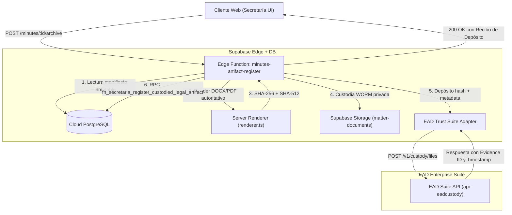

# Auditoría Técnica · Comunicaciones, Interposición y Custodia EAD Trust

**Fecha:** 2026-09-25  
**Autor:** Antigravity / Moises Menendez  
**Issue de referencia:** [MOI-16](https://linear.app/moimene/issue/MOI-16/gobernanza-verificar-comunicaciones-y-custodia-en-el-alcance-del)  
**Milestone:** `M1 · Grupo desde cero y Secretaría operativa`  
**Clave de plan:** `plan:governance-os:moi-16`  
**Entorno de evaluación:** Supabase Cloud `governance_OS` (`hzqwefkwsxopwrmtksbg`, eu-central-1)  

---

## 1. Resumen Ejecutivo y Marco de Gobernanza

El presente informe acredita de forma empírica y exhaustiva el estado real de todas las piezas de comunicación, interposición y custodia del ecosistema **Governance OS / TGMS Platform**, verificando su estricta alineación con la **política de EAD Trust de 21 de julio de 2026**.

### Principios rectores aplicados:
1. **Rol exclusivo de EAD Trust:** EAD Trust (empresa tecnológica del grupo Garrigues, g-digital) es el único QTSP admitido y opera exclusivamente como capa de **interposición, mensajería básica y custodia/e-archiving**.
2. **Prohibición de atribución no acreditada:** El prototipo no atribuye firma electrónica cualificada (QES), firma avanzada, firma simple ni entrega fehaciente (ERDS) a ningún tercero sin respaldo contractual y técnico independiente.
3. **Fail-Closed absoluto:** Cualquier operación no configurada, ambigua o que requiera render autoritativo server-side se bloquea por diseño (*fail-closed*), impidiendo que artefactos generados en el navegador se conviertan en evidencias legales definitivas.
4. **Cero efectos colaterales durante la auditoría:** La auditoría se realiza mediante inspección estática de código y consultas SQL de solo lectura, sin realizar escrituras en base de datos ni llamadas a servicios externos del proveedor.

---

## 2. Inventario y Contratos Técnicos de Operaciones

Se han auditado las 7 funciones de servidor en `supabase/functions/` y los componentes/hooks cliente correspondientes:

### 2.1. `comms-dispatcher` (`supabase/functions/comms-dispatcher/index.ts`)
* **Propósito:** Despachador de la cola de comunicaciones societarias (`communications`).
* **Invocación:** Diseñado para ejecución periódica por `pg_cron` (vía `service_role` JWT) o bajo demanda por usuarios con rol `SECRETARIO` o `ADMIN_TENANT`.
* **Contrato técnico:**
  * **Entradas:** Cabecera `Authorization: Bearer <JWT>`. Parámetros opcionales en cuerpo JSON: `{ batchLimit?: number }`.
  * **Procesamiento:** Fenced por `dispatch_attempt_id`. Consulta filas en `communications` con `estado = 'SCHEDULED'`.
    * Canal `EMAIL` (Resend): `POST https://api.resend.com/emails`. Exige `RESEND_API_KEY`.
    * Canal `EAD_NOTICE` / `ERDS` (EAD Notice Manager): Exige `EAD_NOTICE_MANAGER_SEND_URL` y `EAD_NOTICE_MANAGER_API_KEY`. Si el endpoint devuelve error >= 500 o transporte incierto, la comunicación transiciona a `RECONCILIATION_REQUIRED` y **nunca se reintenta automáticamente**.
  * **Salidas:** JSON `{ processed: number, succeeded: number, failed: number, reconciliation: number }`.
  * **Efectos en DB:** Actualiza `communications.estado` (`ENVIADA`, `ERROR`, `RECONCILIATION_REQUIRED`), registra `fecha_envio_efectiva` y crea filas en `communication_delivery_events`.
* **Estado empírico en Cloud DB:**
  * La tarea programada en `cron.job` (`jobid: 1`) se encuentra **DESACTIVADA** (`active: false`).
  * En toda la base de datos hay 0 comunicaciones con `estado = 'SCHEDULED'`.
  * En toda la base de datos hay 0 filas en `communication_delivery_events`.

### 2.2. `qtsp-proxy` (`supabase/functions/qtsp-proxy/index.ts`)
* **Propósito:** Frontera server-side para interposición y e-archiving con EAD Enterprise Suite (`https://api-eadcustody.eadtrust.gocertius.io`).
* **Router de acciones (11 acciones):**
  1. `sign`: Devuelve HTTP 410 `GENERIC_PROVIDER_ACTION_RETIRED` (*"La acción genérica sign está retirada..."*).
  2. `status`: Devuelve HTTP 410 `GENERIC_PROVIDER_ACTION_RETIRED` (*"La consulta genérica al proveedor está retirada..."*).
  3. `artifacts`: Devuelve HTTP 410 `GENERIC_PROVIDER_ACTION_RETIRED` (*"La descarga genérica de artefactos está retirada..."*).
  4. `archive_final_legal_artifact`: Devuelve HTTP 409 `AUTHORITATIVE_BINARY_REQUIRED` (*"La custodia final exige un binario generado y registrado de forma autoritativa en servidor..."*). Fail-closed total: **no contacta con EAD Trust ni crea artefacto legal**.
  5. `archive_annual_accounts_execution`: Devuelve HTTP 409 `AUTHORITATIVE_BINARY_REQUIRED`.
  6. `archive_annual_accounts_component_input`: Valida SHA-256 de balance/cuenta y almacena en storage.
  7. `record_annual_accounts_external_signature`: Registra revisión de firma externa conforme al art. 253 LSC.
  8. `record_annual_accounts_missing_signature_cause`: Persiste causa motivada de ausencia de firma (art. 253.2 LSC) vía RPC `fn_secretaria_record_annual_accounts_missing_signature_cause`.
  9. `reconcile_verified_signature`: Reconciliación de filas source-bound preexistentes ligadas a hash exacto.
  10. `reconcile_annual_accounts_signature`: Idem para cuentas anuales.
  11. `evidence`: Sube fichero a EAD Evidence Manager únicamente si las credenciales de Suite están configuradas.
* **Control de configuración:** `readConfig()` requiere `EAD_SUITE_AUTH_EMAIL` y `EAD_SUITE_AUTH_PASSWORD`. Si faltan, devuelve HTTP 503 `QTSP_PROXY_NOT_CONFIGURED`.
* **Estado empírico en Cloud DB:**
  * 0 actas con `final_legal_artifact_id` (13 actas en ARGA, todas sin artefacto final; 0 en Garrigues; 0 en Grupo Nuevo).
  * 0 certificaciones con `final_legal_artifact_id`.
  * 0 filas en `secretaria_legal_artifacts`.
  * 0 filas en `secretaria_ead_interposition_evidence`.
  * 0 filas en `qtsp_signature_requests`.

### 2.3. `convocation-artifact-register` (`supabase/functions/convocation-artifact-register/index.ts`)
* **Propósito:** Renderer autoritativo en servidor para la convocatoria final DOCX.
* **Contrato técnico:**
  * **Entradas:** HTTP POST con `{ convocatoriaId: string, expectedManifestHashSha512?: string }`. Requiere JWT.
  * **Procesamiento:** Lee `convocation_manifests` inmutable de la base de datos; valida `data_class = 'DEMO'`; renderiza el DOCX mediante el motor OOXML server-side (`renderer.ts`, contrato `2026-07-21.1`); computa SHA-256 y SHA-512; lo custodia en Supabase Storage privado (`matter-documents`); vincula el registro mediante `convocation_acts`.
  * **Salidas:** `{ ok: true, artifactId, storageUri, hashSha256, hashSha512, sizeBytes }`.
  * **Declaración explícita:** Autocontenido en Supabase. No contacta proveedores externos ni realiza afirmaciones de firma electrónica.
* **Estado empírico en Cloud DB:**
  * 7 manifiestos de convocatoria inmutables (5 en ARGA, 2 en Grupo Nuevo).
  * Todos con `data_class = 'DEMO'` y `legal_effect = 'DEMO_SIMULATION_NO_LEGAL_EFFECT'`.

### 2.4. `convocation-supporting-artifact-register` (`supabase/functions/convocation-supporting-artifact-register/index.ts`)
* **Propósito:** Límite de verificación server-side para documentos anexos de convocatoria.
* **Contrato técnico:**
  * **Entradas:** HTTP POST con metadatos del anexo, storage URI y hashes esperados.
  * **Procesamiento:** Valida firmas mágicas (`%PDF-` o DOCX ZIP `PK\x03\x04`), tamaño <= 25 MB, recalcula SHA-256 y SHA-512 y ancla el anexo WORM.
  * **Salidas:** `{ ok: true, artifactId, verifiedSize, hashSha256, hashSha512 }`.
* **Estado empírico en Cloud DB:**
  * 9/9 anexos WORM verificados en la convocatoria canónica UAT de ARGA (`ef574517…`).
  * 0 anexos en Grupo Nuevo (convocatoria `28bc0b69…` emitida sin anexos previos).

### 2.5. `sign-evidence-url` (`supabase/functions/sign-evidence-url/index.ts`)
* **Propósito:** Generación de URLs firmadas temporales para lectura de evidencias en bucket privado `matter-documents`.
* **Contrato técnico:**
  * **Entradas:** HTTP POST con `{ bundle_id: string }`.
  * **Procesamiento:** Verifica RLS del tenant del usuario, comprueba `legal_hold = false` y que el estado no sea `ARCHIVED-PENDIENTE-LEGAL`. Genera URL firmada con TTL de 300 segundos (5 minutos).
  * **Salidas:** `{ url: string, expires_at: string }`.
* **Estado empírico:** Operativo para lectura autorizada; 0 llamadas a proveedores externos.

### 2.6. `webhook-ead-trust` (`supabase/functions/webhook-ead-trust/index.ts`)
* **Propósito:** Recepción de callbacks de entrega o custodia de EAD Trust.
* **Contrato técnico:**
  * **Entradas:** HTTP POST con cabeceras `x-eadtrust-signature` y `x-eadtrust-timestamp`.
  * **Verificación:** HMAC-SHA256 con secreto `EAD_TRUST_WEBHOOK_SECRET` y ventana de tolerancia de ±300s.
  * **Comportamiento fail-closed:** Si `EAD_TRUST_WEBHOOK_SECRET` no está configurado, responde HTTP 503 `EAD_TRUST_WEBHOOK_SECRET not configured`.
* **Estado empírico:** Inactivo / fail-closed. 0 callbacks recibidos.

### 2.7. `webhook-resend` (`supabase/functions/webhook-resend/index.ts`)
* **Propósito:** Recepción de eventos de entrega de correo desde Resend / Svix.
* **Contrato técnico:**
  * **Entradas:** HTTP POST con cabeceras `svix-id`, `svix-timestamp`, `svix-signature`.
  * **Verificación:** HMAC-SHA256 Svix con secreto `RESEND_WEBHOOK_SECRET` (prefijo `whsec_`).
  * **Comportamiento fail-closed:** Si el secreto no está configurado, responde HTTP 503 `Webhook secret not configured`.
* **Estado empírico:** Inactivo / fail-closed. 0 eventos recibidos.

### 2.8. Componentes y Hooks del Cliente
* **`src/hooks/useQTSPSign.ts`:** `signMutation` y `notifyMutation` lanzan excepciones síncronas irrevocables:
  * `RETIRED_SIGN_MESSAGE`: *"La firma electrónica genérica está retirada. Use el flujo autoritativo del expediente para interposición y custodia/e-archiving."*
  * `CONTROLLED_MESSAGE`: *"La mensajería genérica está retirada. Use la comunicación source-bound, que reserva destinatarios y registra sus resultados."*
* **`src/lib/qtsp/ead-trust-client.ts`:** En el bundle de cliente, `clientSecret` es cadena vacía. Cualquier llamada a `getOktaToken()` lanza inmediatamente excepción `QTSP_SERVER_PROXY_REQUIRED`.
* **`src/components/secretaria/EADInterpositionControl.tsx`:** Control visual con botón permanentemente deshabilitado (`disabled`, `aria-disabled="true"`), badge *"Pendiente de renderer autoritativo"* y mensaje de bloqueo explícito (*"Custodia final bloqueada: falta un binario generado y registrado de forma autoritativa en servidor"*).
* **`src/lib/secretaria/certification-kind-scope.ts`:** Filtra en cliente cualquier tipo que afirme ERDS, entrega o firma cualificada. En Cloud DB, los 3 tipos identificados (`CERT_ERDS_ENTREGA`, `CERT_COMUNICACIONES_REGULATORIAS`, `CERT_ENVIO_CONVOCATORIA`) fueron desactivados (`is_active = false`) en la migración `20260925100000` (MOI-145).

---

## 3. Matriz Comparativa Tridimensional por Entorno

| Operación | Parámetro / Objeto | Entorno ARGA (`…0001`) | Entorno Garrigues (`…0002`) | Entorno Grupo Nuevo (`…0003`) | Justificante Empírico |
|---|---|---|---|---|---|
| **Convocatoria DOCX final** | Render autoritativo server-side | Convocatoria canónica UAT `ef574517…` renderizada (13 págs) | 0 convocatorias | Convocatoria canónica `28bc0b69…` renderizada (28.125 B) | `convocation_manifests` (7 filas, todas `DEMO` y `NO_LEGAL_EFFECT`) |
| **Custodia de Actas** | `final_legal_artifact_id` | 0 de 13 actas en custodia final (todas `NULL`) | 0 actas | 0 actas (reunión `CONVOCADA` para 2026-10-15) | SQL `SELECT count(final_legal_artifact_id) FROM minutes` = 0 |
| **Atribución de Firma en Actas** | `approval_signature_claim` | 0 de 13 actas con firma atribuida (todas `false`) | N/A | N/A | SQL `SELECT count(*) FROM minutes WHERE approval_signature_claim = true` = 0 |
| **Certificaciones autónomas** | Emisión y custodia | 2 certificaciones históricas emitidas (`DEMO_ARCHIVED`) | 0 certificaciones | 0 certificaciones | SQL `standalone_certifications` (2 en ARGA, 0 en Garrigues/GN) |
| **Catálogo de certificaciones** | Tipos activos en UI | 38 tipos legítimos ofrecidos; 3 tipos desestimados | 0 tipos propios (hereda catálogo general) | 38 tipos legítimos ofrecidos; 3 tipos desestimados | SQL `standalone_certification_kinds` + `secretaria-certificaciones-activas-scope.test.ts` (6 pass) |
| **Cola de comunicaciones** | Despacho automático de envíos | 4 filas (3 `CANCELADA`, 1 `BORRADOR`); 0 efectivas | 0 comunicaciones | 0 comunicaciones (bandeja neutral vacía) | SQL `communications` (0 en `SCHEDULED`, 0 en `fecha_envio_efectiva`) |
| **Trabajo programado (cron)** | Invocación periódica de dispatcher | Tarea `jobid: 1` **DESACTIVADA** | Tarea `jobid: 1` **DESACTIVADA** | Tarea `jobid: 1` **DESACTIVADA** | SQL `SELECT jobid, active FROM cron.job` -> `active = false` |
| **Eventos de entrega** | Callbacks o webhooks de entrega | 0 eventos | 0 eventos | 0 eventos | SQL `SELECT count(*) FROM communication_delivery_events` = 0 |
| **Evidencias EAD registradas** | Depósito / hash en Suite | 0 evidencias | 0 evidencias | 0 evidencias | SQL `SELECT count(*) FROM secretaria_ead_interposition_evidence` = 0 |

---

## 4. Auditoría de Variables de Entorno y Declaración de Efectos Reales

### 4.1. Variables auditadas por nombre (sin revelar valores)
* **Proveedor de correo (Resend):**
  * `RESEND_API_KEY` (Edge Function `comms-dispatcher`)
  * `RESEND_WEBHOOK_SECRET` (Edge Function `webhook-resend`)
  * `REMITENTE_EMAIL`, `REMITENTE_NOMBRE`, `DISPATCHER_BATCH_LIMIT`
* **Proveedor QTSP / Interposición / Mensajería (EAD Trust):**
  * `EAD_NOTICE_MANAGER_SEND_URL`
  * `EAD_NOTICE_MANAGER_PACKAGE_SEND_URL`
  * `EAD_NOTICE_MANAGER_PACKAGE_CONTRACT`
  * `EAD_NOTICE_MANAGER_API_KEY`
  * `EAD_TRUST_API_URL`
  * `EAD_TRUST_API_KEY`
  * `EAD_TRUST_WEBHOOK_SECRET`
* **Proveedor QTSP / Suite de Custodia (EAD Trust):**
  * `EAD_SUITE_API_BASE_URL` (default: `https://api-eadcustody.eadtrust.gocertius.io`)
  * `EAD_SUITE_AUTH_EMAIL`
  * `EAD_SUITE_AUTH_PASSWORD`

### 4.2. Declaración formal sobre efectos reales
1. **¿Puede el sistema producir hoy un envío real de correo o burofax/ERDS?**
   **NO.** La tarea de `pg_cron` que llama a `comms-dispatcher` está inactiva (`active = false`). La tabla `communications` no tiene ningún registro en estado `SCHEDULED`. Si un usuario programa una comunicación en modo demo, no se desencadenan envíos externos.
2. **¿Puede el sistema producir hoy una firma cualificada o custodia real con EAD Trust?**
   **NO.** Todas las rutas genéricas de firma en `qtsp-proxy` están formalmente retiradas con HTTP 410. La ruta de custodia final `archive_final_legal_artifact` responde con HTTP 409 `AUTHORITATIVE_BINARY_REQUIRED` sin contactar con los servidores de EAD Trust. En el frontend, `useQTSPSign` lanza un error inmediato y `ead-trust-client` aborta con `QTSP_SERVER_PROXY_REQUIRED`.
3. **Conclusión:** En el estado actual del prototipo, **cero operaciones producen efectos jurídicos o externos reales**, garantizando plenamente la condición de prototipo operativo seguro y confinado.

---

## 5. Verificación Empírica sobre el Expediente de Grupo Nuevo

Sobre el grupo nuevo (`tenant_id = 00000000-0000-0000-0000-000000000003`), creado y recorrido en MOI-53 y MOI-15:
1. **Reunión convocada del Consejo (`ffd71122…`):**
   * Estado: `CONVOCADA` para el 15 de octubre de 2026.
   * La UI y el motor de base de datos impiden su apertura anticipada (`MEETING_OPEN_TOO_EARLY`, SQLSTATE 22023).
   * No existe acta redactada ni firmada; 0 afirmaciones de firma.
2. **Convocatoria emitida (`28bc0b69…`):**
   * Artefacto DOCX generado exclusivamente en servidor desde el manifiesto canónico inmutable.
   * Manifiesto etiquetado con `data_class = 'DEMO'` y `legal_effect = 'DEMO_SIMULATION_NO_LEGAL_EFFECT'`.
   * Ninguna pantalla afirma entrega certificada ni firma por QTSP.
3. **Certificaciones autónomas (`/secretaria/certificaciones`):**
   * El selector de tipos presenta los 38 tipos legales válidos y omite los 3 tipos desestimados.
   * Rótulo visible en la cabecera del selector: *"3 tipos configurados no se ofrecen: su enunciado atribuye a un tercero capacidades de firma, envío o entrega que no están disponibles en el alcance vigente"*.
   * El componente `EADInterpositionControl` muestra el botón de custodia en estado deshabilitado (`disabled`, `aria-disabled="true"`) con la leyenda: *"Custodia final no disponible: falta un binario generado y registrado de forma autoritativa en servidor"*.
4. **Comunicaciones y Calendario (`/secretaria/comunicaciones`):**
   * Bandeja completamente limpia (0 comunicaciones registradas).
   * Estado neutral: sin envíos simulados, sin marcas engañosas de entrega.

---

## 6. Propuesta Técnica de Adaptador en Servidor para EAD Trust (sin construir)

Conforme al criterio de aceptación de MOI-16, se formaliza la siguiente propuesta de arquitectura para su evaluación y eventual aprobación en **MOI-144** (*«Secretaría · Decidir si se construye la custodia final de actas con EAD Trust»*):

### 6.1. Arquitectura de 4 capas

### 6.2. Especificaciones de diseño:
1. **Límite autoritativo en servidor:** El cliente web jamás envía los bytes del documento para su custodia legal definitiva. Únicamente envía el identificador del expediente (`minute_id` o `certification_id`) y el hash esperado.
2. **Generación determinista:** El servidor compila el binario DOCX/PDF directamente desde el snapshot inmutable de base de datos (`convocation_manifests`, `minutes.authoritative_manifest`), garantizando coincidencia absoluta entre el texto aprobado y el binario custodiado.
3. **Interposición EAD Enterprise Suite:** La Edge Function invoca el endpoint de custodia de EAD Trust aportando el hash SHA-512, identificador de expediente y metadatos de clasificación. EAD Trust actúa exclusivamente como depositario de evidencia (*e-archiving*), emitiendo un identificador de evidencia (`evidenceId`) y marca de tiempo de depósito.
4. **Persistencia WORM:** La evidencia se ancla mediante la RPC existente `fn_secretaria_register_custodied_legal_artifact`, actualizando `final_legal_artifact_id` y cerrando el expediente.
5. **Condición de activación:** Este adaptador permanece en estado **propuesta de diseño (sin construir)** y su implementación efectiva requiere previamente la confirmación técnica y contractual de **MOI-216** y la autorización expresa en **MOI-144**.

---

## 7. Dictamen de Verificación y Cierre

1. **Estado del issue MOI-16:** Cumple íntegramente todos los requisitos técnicos y criterios de hecho.
2. **Nivel de madurez alcanzado:** **Probado y Preparado** para incorporación formal autorizada.
3. **Acciones siguientes:**
   * Guardar este informe en el repositorio en rama de trabajo.
   * Solicitar la autorización escrita de Moisés para incorporación a `main`.
   * Enlazar la propuesta técnica en el issue **MOI-144**.
   * Proceder con el issue **MOI-133** (vinculación de perfiles a personas en Grupo Nuevo) para desbloquear el recorrido operativo de AIMS (**MOI-55**).
